# REPORT
[toc]

## 前置知识

### 冲突检测

考虑二维下的冲突检测。R为保护区域的半径。计算出两飞机的相对速度和距离，观察相对速度是否和保护区域相交即可判断。可以通过解一元二次方程来求出水平方向进入保护区和离开保护区的$t_{inhor}$, $t_{inhor}$。

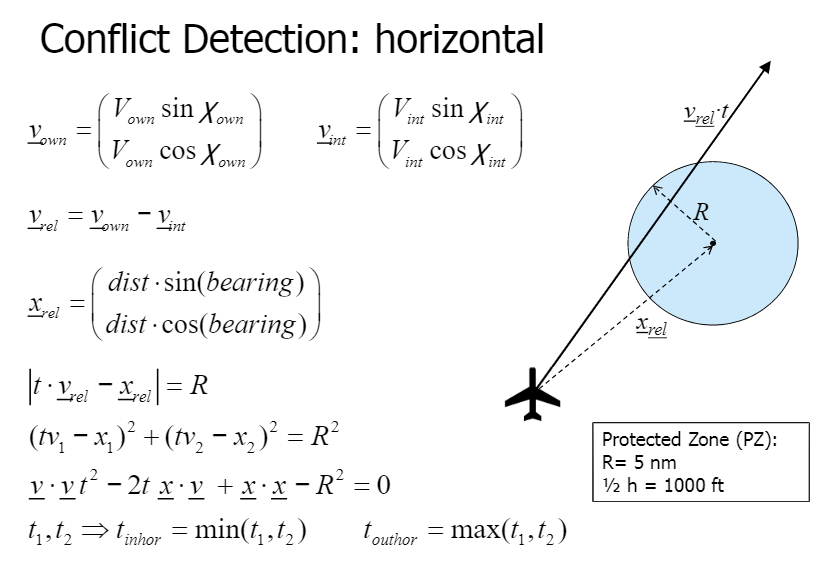

考虑三维下的冲突检测。只要考虑垂直方向的即可。$2\Delta h$为保护区的垂直高度。考虑两个飞机的情况，将飞机a固定，可求出飞机b在垂直方向上第一次距离a为$\Delta h$（进入保护区）的时间$t_{invert}$以及第二次距离a为$\Delta h$（离开保护区）的时间$t_{outvert}$。
综合起来$t_{in}$, $t_{out}$满足如下的关系时可以判断将会发生冲突。其中$t_{lookahead}$为向前预测的最大时间。

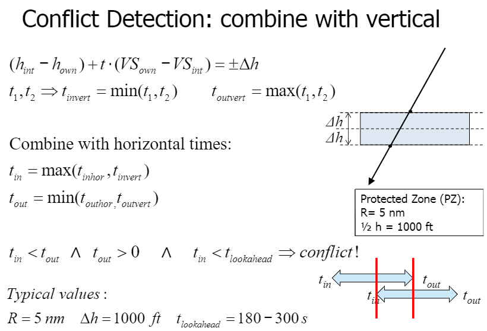

### CPA

CPA: Closet point of approach，可由几何方法得出，令相对速度方向与圆相切即可，切点即为CPA。

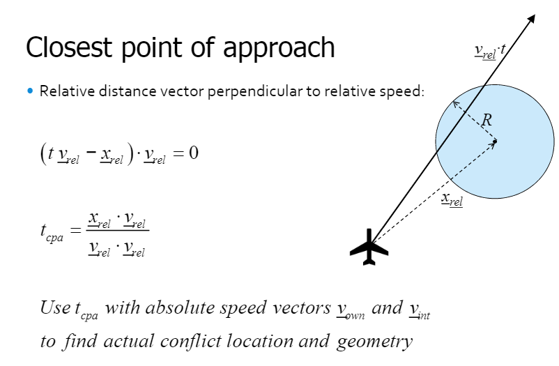

### BlueSky用法

#### 启动

- 安装不再赘述。
- 安装后运行最外层的`BlueSky.py`，即可启动bluesky。直接不带参数运行`python BlueSky.py`会直接在本机模拟。还可以根据不同的参数以客户端、服务器等不同方式启动，具体见`Bluesky.py`。
- 启动时如果报端口已占用错误，则将settings.cfg内的端口号改为本机空闲端口即可。
- 启动后如下

    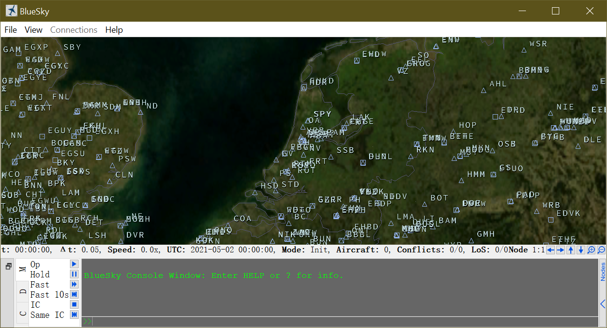

#### 场景文件

- 其中以.scn结尾的为场景文件，其实就是一个记录了bluesky的命令的文本文件。bluesky会按顺序读取这个文件的命令并依次执行。demo中的这些命令大多是在某时刻某位置产生什么飞机，具体的bluesky的命令见doc文件夹下的手册。
- 我将论文中所用的场景文件放在了scenario文件夹中。
- （最新版本的bluesky将自带的demo快删完了，也许是终于发现自己给的大多demo跑不了）

#### 选择算法

- 输入命令RESO即可查看当前使用的CR算法
- 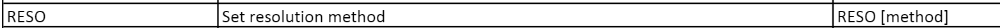
- 输入`RESO [method_name]`即可设置当前CR算法
- 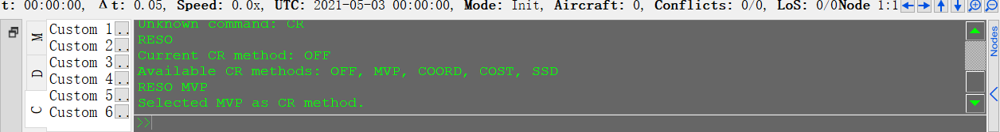
  
#### 模拟过程

- 打开对应的场景文件即可运行。

    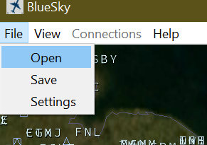

- 可以根据下方选项进行调整。
    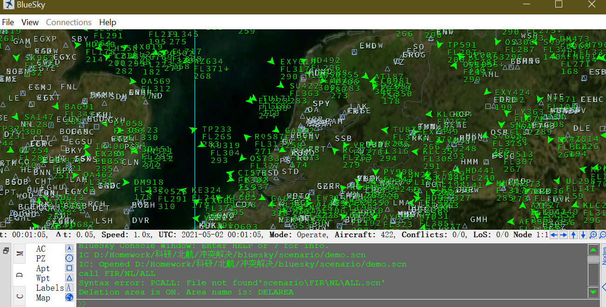


#### 记录结果

##### 如何记录

- 踩了无数的坑才发现，若想自动记录结果，需要规定实验区域(experiment area)。只有在实验区域的飞机才会被记录。
- 规定好实验区后运行scn文件即可自动进行记录。
- 实验区域通过AREA命令来规定。
    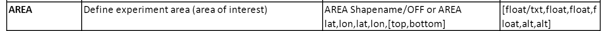
- 可以看demo如何用的(demo.scn)：
    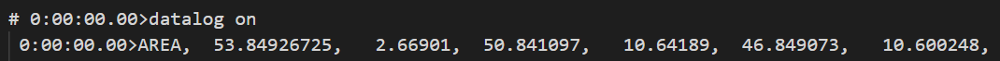
- 我找的论文中的场景文件并没有规定实验区域，如果要用那个scn的话需要自己手动添加

##### 所记录的内容

- 内容存放在.log文件中，位于out文件夹下
- 所记录的内容为某时刻有多少飞机如何碰撞
  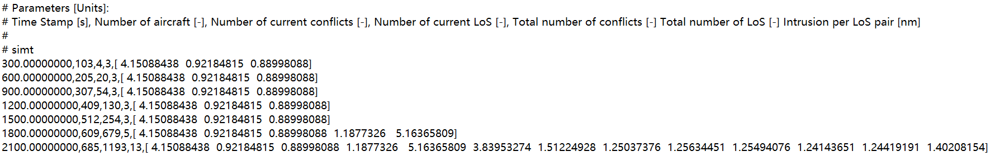

## Potential Field

- 将相互发生冲突的飞机视为带同性电荷的小球，小球间存在相互排斥的力，该力将导致小球相互分开。
- 对于每对相互冲突的飞机，认为其最近的接触点（CPA）处存在斥力，该力产生的位移能将冲突的飞机分离至最小安全距离。
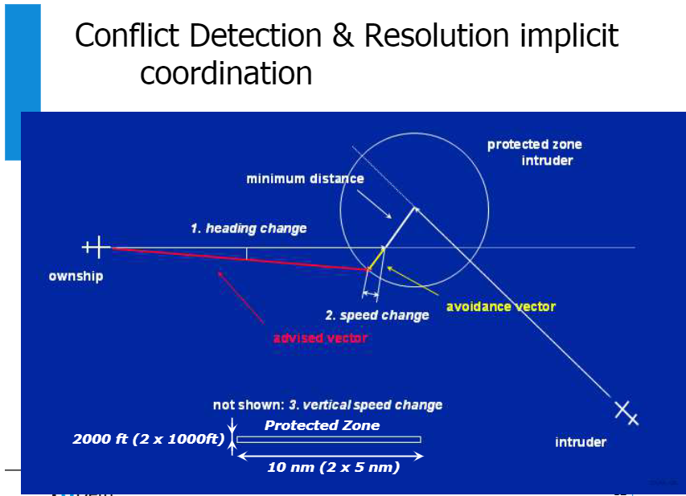
- 实现时，无需涉及力，只需计算CPA至最近的安全位置处所需位移量$|R-d_{cpa}|$即可，由位移量以及发生冲突的时间$t_{cpa}$即可算出所需调整的速度$dv$:
$$
dv=\frac{|R-d_{cpa}|}{t_{cpa}}
$$
- 关键代码：
    ```python
    # If intruder is outside the ownship PZ, then apply extra factor
    # to make sure that resolution does not graze IPZ
    if (conf.rpz * self.resofach) < dist and dabsH < dist:
        # Compute the resolution velocity vector in horizontal direction.
        # abs(tcpa) because it bcomes negative during intrusion.
        erratum=np.cos(np.arcsin((conf.rpz * self.resofach)/dist)-np.arcsin(dabsH/dist))
        dv1 = (((conf.rpz * self.resofach)/erratum - dabsH)*dcpa[0])/(abs(tcpa)*dabsH)
        dv2 = (((conf.rpz * self.resofach)/erratum - dabsH)*dcpa[1])/(abs(tcpa)*dabsH)
    else:
        dv1 = (iH * dcpa[0]) / (abs(tcpa) * dabsH)
        dv2 = (iH * dcpa[1]) / (abs(tcpa) * dabsH)
    ```
    注意分两种情况进行讨论。
    其中第一种情况的所需偏移量displacement如下：
    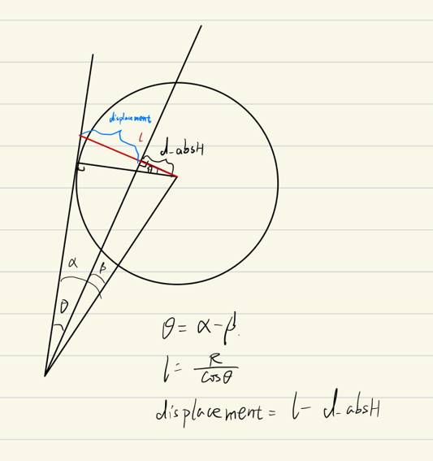


## Solution Space

- 二维下，飞机的速度取值可以构成一个圆，最小速度和最大速度形成一对同心圆，合法的速度在这两个同心圆之间。
- 同时，计算出将会发生碰撞的速度的取值，如图中的三角形区域。
- 减去图中三角形区域，即为所有合法的速度取值。
- 选取最终的解时，按照“最近原则”选取。即在边界上的值。
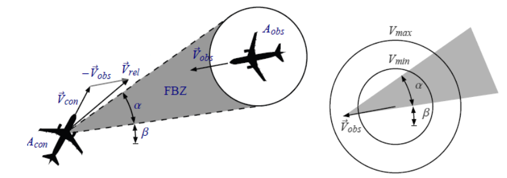

## Explicit Coordination

- 发生碰撞的飞机之间交互信息，确定所要采取的避免冲突的操作。该操作要保证不会产生新的冲突，以保证收敛
- 采取避免冲突的操作后，如果此时没有冲突则停止。否则继续。
- 选取的避免冲突操作的方差要尽可能小，以保证快速收敛。

## Sequential Cost

- 定义路线的代价
- 找出最小代价的路径
- 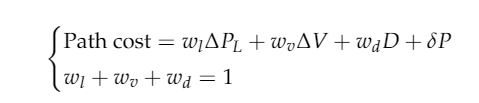
